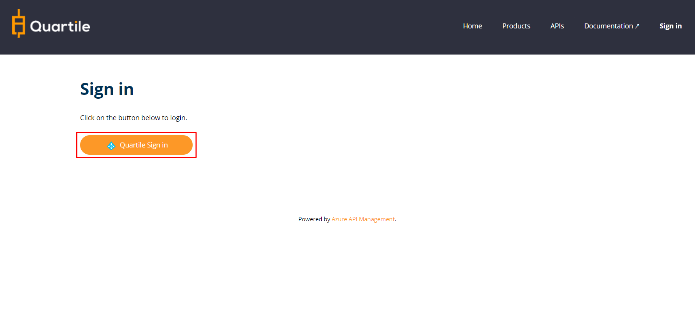

## Step 1 - Access The Developer Portal

* [Click here to access portal:](https://apim-qd-open-api.developer.azure-api.net)

### Click on "__Sign In__".

### Login using your Azure Active Directory B2C.

### Sign in using your AD B2C email and password.

### Complete the form and click "__Sign Up__".

## Step 2 - Verify subscriber

After registration, it is necessary to validate your subscription.

### Check Your Email
You will receive the confirmation email.
