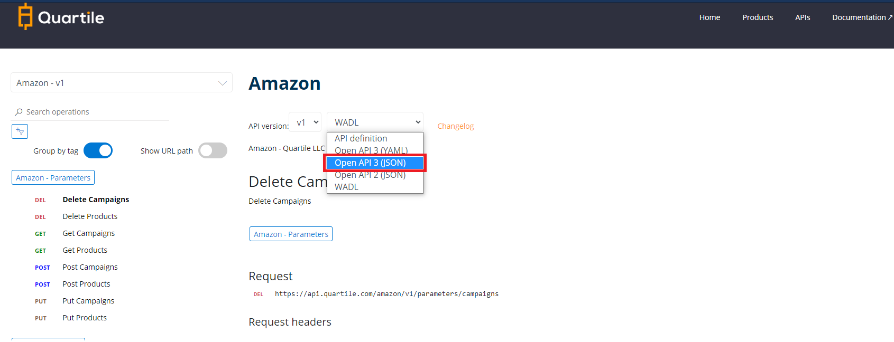

## Specification

The OpenAPI Specification (OAS) defines a standard, language-agnostic interface to RESTful APIs which allows both humans and computers to discover and understand the capabilities of the service without access to source code, documentation, or through network traffic inspection. When properly defined, a consumer can understand and interact with the remote service with a minimal amount of implementation logic.

An OpenAPI definition can then be used by documentation generation tools to display the API, code generation tools to generate servers and clients in various programming languages, testing tools, and many other use cases.

<small> P.S.: [References](https://swagger.io/specification/){:target="_blank"}</small>

## Swagger

Simplify API development for users, teams, and enterprises with the Swagger open source and professional toolset.

Use Swagger as a best-practice reference for arranging APIs.

<small> P.S.: [References](https://swagger.io){:target="_blank"}</small>

## Postman

Postman is an API platform for building and using APIs. Postman simplifies each step of the API lifecycle and streamlines collaboration so you can create better APIs—faster.

Use Postman with an alternative to test and copy the endpoint call.

#### Export the openapi.json file from the Developer Portal.

#### Import into Postman.

[Postman tutorial - Click here](https://learning.postman.com/docs/integrations/available-integrations/working-with-openAPI/){:target="_blank"}

<small> P.S.: [References](https://www.postman.com/){:target="_blank"}</small>
